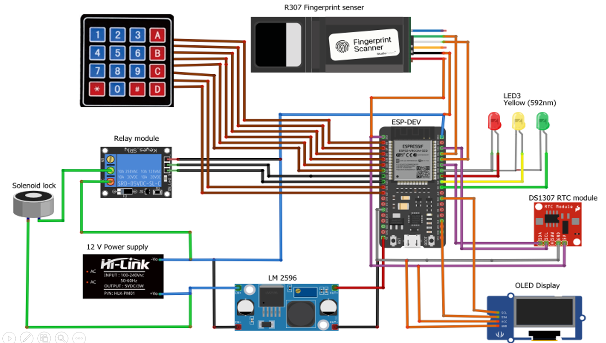
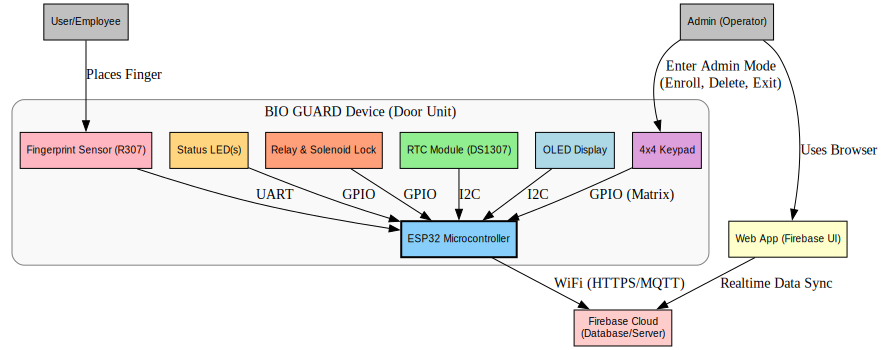

# BIO GUARD ATTENDANCE

## Biometric Door Locking and Attendance System

## Overview
This system integrates a fingerprint scanner, solenoid lock, and web application with the ESP32 microcontroller to enhance security and manage attendance efficiently. Key functionalities include:
- Biometric Authentication: Uses the R307 fingerprint sensor for secure and precise identification.
- Access Control: Manages access via a solenoid lock activated by verified fingerprints.
- Data Management and Logging: Syncs attendance data in real-time with a web platform.

## Features
- Biometric Authentication: Ensures high reliability and secure user identification with the R307 sensor.
- Access Control: Solenoid lock activates upon successful fingerprint authentication, securing entry.
- Attendance Tracking: Records entries and exits in real-time, integrating data into a web application for accurate monitoring.
- Web Application: Allows administrators to oversee access records, adjust user settings, and analyze attendance data.

## Final Product Images

| Front View | Side View | Angle View |
|------------|-----------|------------|
|  |  |  |

## Hardware Components
- ESP32 Development Board: Central processing unit with extensive Wi-Fi and Bluetooth capabilities, perfect for IoT solutions.
- AS608 Fingerprint Sensor: Offers fast and accurate scanning, ideal for high-security setups.
- Solenoid Lock: Provides physical access control by locking or unlocking doors based on authentication.
- OLED Display: Displays system statuses and instructions directly at the point of access.
- Power Supplies: Dedicated sources ensure stable operation for both the lock and the board/sensors.

## Circuit Diagram
- View the circuit diagram in the "Circuit.jpeg" file located in the Images Directory.
  

## Architecture Diagram

### High-Level Architecture Diagram

> High-level architecture diagram of the BIO GUARD Attendance System. The ESP32-based door unit (left, gray box) interfaces with all hardware components (fingerprint sensor, keypad, OLED display, RTC, relay, LEDs). The ESP32 connects via Wi-Fi to the Firebase cloud (center), which stores log data and user info. An admin user (right) can access this data through a web application in real time. In addition, the admin can directly operate the door unit via the keypad to enroll, delete fingerprints, or exit admin mode.

- **Communication Protocols**:
    - UART for fingerprint sensor.
    - I2C for OLED Display & RTC.
    - GPIO for keypad, relay, and LEDs.
    - Wi-Fi (HTTPS/MQTT) for cloud communication.

- **System Description**:
    - The ESP32 microcontroller is the heart of the door unit, managing peripheral devices and network connectivity.
    - The R307 fingerprint sensor connects to the ESP32 via UART for secure biometric data exchange.
    - The 4x4 matrix keypad is connected via GPIOs (configured as a matrix) for PIN entry, admin access, and system interaction.
    - Both the OLED display and DS1307 RTC are on the shared I2C bus.
    - The ESP32 drives the relay to control the solenoid lock and also manages status LEDs through GPIO.
    - The ESP32 connects to Firebase Cloud over Wi-Fi using HTTPS REST API or MQTT for data synchronization.
    - Firebase handles real-time logging and user data management.
    - The Admin interacts with the system:
        - **Remotely** via the web application for monitoring and managing users.
        - **Directly** via the keypad to perform enrollment, deletion, or administrative operations.
    - Users/Employees interact only with the door unit through the fingerprint sensor and keypad.

> **Separation of Concerns**: 
> - The door unit handles real-time access control and user interaction.
> - Firebase manages data storage and synchronization.
> - The Web Application provides remote administration.

## Project Team
- 2021/E/006 Jenarththan A.
- 2021/E/015 Mathushanth A.M.
- 2021/E/123 Roycetheeban R.
- 2021/E/190 Nathiskar S.

## Usage
- Admins: Log into the web application for user management, log viewing, and settings adjustments.
- Users: Register fingerprints through the admin panel, then access controlled doors by verifying fingerprints at the scanner.

