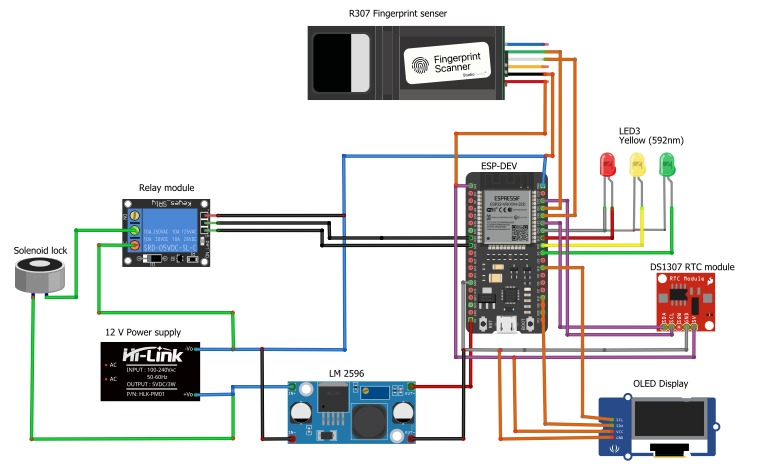

# Biometric Door Locking and Attendance System

## Overview
This system integrates a fingerprint scanner, solenoid lock, and web application with the ESP32 microcontroller to enhance security and manage attendance efficiently. Key functionalities include:
- Biometric Authentication: Uses the R307 fingerprint sensor for secure and precise identification.
- Access Control: Manages access via a solenoid lock activated by verified fingerprints.
- Data Management and Logging: Syncs attendance data in real-time with a web platform.

## Features
- Biometric Authentication: Ensures high reliability and secure user identification with the R307 sensor.
- Access Control: Solenoid lock activates upon successful fingerprint authentication, securing entry.
- Attendance Tracking: Records entries and exits in real-time, integrating data into a web application for accurate monitoring.
- Web Application: Allows administrators to oversee access records, adjust user settings, and analyze attendance data.

## Hardware Components
- ESP32 Development Board: Central processing unit with extensive Wi-Fi and Bluetooth capabilities, perfect for IoT solutions.
- R307 Fingerprint Sensor: Offers fast and accurate scanning, ideal for high-security setups.
- Solenoid Lock: Provides physical access control by locking or unlocking doors based on authentication.
- OLED Display: Displays system statuses and instructions directly at the point of access.
- Power Supplies: Dedicated sources ensure stable operation for both the lock and the board/sensors.

## Circuit Diagram
- View the circuit diagram in the "Circuit.jpeg" file located in the Images Directory.
  

## Project Team
- 2021/E/006 Jenarththan A.
- 2021/E/015 Mathushanth A.M.
- 2021/E/123 Roycetheeban R.
- 2021/E/190 Nathiskar S.

## Usage
- Admins: Log into the web application for user management, log viewing, and settings adjustments.
- Users: Register fingerprints through the admin panel, then access controlled doors by verifying fingerprints at the scanner.
